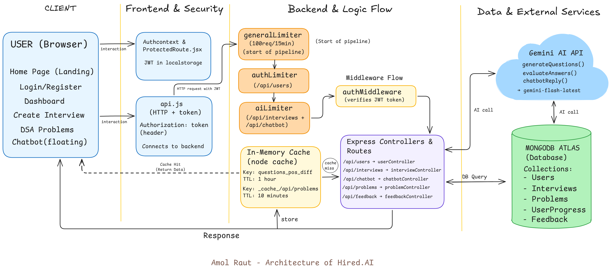

# 🤖 Hired.AI — AI-Powered Interview Preparation Platform

<div align="center">

[](https://reactjs.org/)
[](https://nodejs.org/)
[](https://expressjs.com/)
[](https://www.mongodb.com/)
[](https://ai.google.dev/)
[](https://vercel.com/)

**A full-stack MERN application that simulates real interview scenarios using Google Gemini AI — with production-grade system design principles implemented.**

[🚀 Live Demo](#) · [📖 API Docs](#api-endpoints) · [🏗️ Architecture](#system-architecture)

</div>

---

## 📌 Table of Contents

- [Overview](#overview)
- [Key Features](#key-features)
- [System Architecture](#system-architecture)
- [System Design Principles](#system-design-principles)
- [Tech Stack](#tech-stack)
- [Project Structure](#project-structure)
- [Getting Started](#getting-started)
- [API Endpoints](#api-endpoints)
- [Environment Variables](#environment-variables)

---

## 🎯 Overview

**Hired.AI** is an AI-powered interview preparation platform that helps candidates practice technical and behavioral interviews tailored to their target role and experience level.

Users can create mock interviews, answer questions via **text or voice**, and receive **instant AI-driven feedback** with scores and suggested answers — simulating a real interview experience.

> 💡 Built as a final year project and enhanced with **production-grade system design** including multi-tier rate limiting and intelligent caching.

---

## ✨ Key Features

| Feature | Description |
|---|---|
| 🎙️ **Voice Interview Mode** | Answer questions by speaking — powered by Web Speech API |
| 🤖 **AI Question Generation** | Role-specific questions generated by Google Gemini AI |
| 📊 **AI Feedback & Scoring** | Each answer scored 0–10 with detailed feedback and suggested answers |
| 💬 **AI Chatbot** | Floating assistant for platform guidance and interview tips |
| 📝 **DSA Practice Tracker** | Curated DSA problem sheet with progress tracking |
| 🔐 **JWT Authentication** | Secure login/register with token-based auth |
| 🛡️ **Rate Limiting** | Multi-tier rate limiting to prevent abuse and control AI costs |
| ⚡ **Response Caching** | In-memory caching for AI responses and DB queries |

---

## 🏗️ System Architecture

<div align="center">



</div>

The application is divided into **4 zones**:

**Zone 1 — Client:** React frontend with protected routes and JWT auth context.

**Zone 2 — Frontend & Security:** `AuthContext` manages JWT stored in localStorage. `api.js` attaches the token to every request header.

**Zone 3 — Backend & Logic Flow:** All requests pass through a middleware pipeline — Rate Limiters → Auth Middleware → Cache Check → Controllers.

**Zone 4 — Data & External Services:** MongoDB Atlas for persistence, Google Gemini AI for question generation and evaluation.

---

## 🔧 System Design Principles

This project implements two core system design concepts:

### 1. 🛡️ Multi-Tier Rate Limiting

```
Every Request
     ↓
generalLimiter     → 100 requests / 15 min  (all routes)
     ↓
authLimiter        → 10 requests / 15 min   (/api/users)
     ↓
aiLimiter          → 20 requests / 1 hour   (/api/interviews, /api/chatbot)
```

**Why:**
- `authLimiter` prevents brute-force attacks on login/register
- `aiLimiter` prevents Gemini API abuse and controls cost
- `generalLimiter` acts as baseline DDoS protection

**Response when limit exceeded:**
```json
{
  "status": 429,
  "error": "Too many requests, please try again after 15 minutes."
}
```

**Standard headers sent with every response:**
```
RateLimit-Limit: 100
RateLimit-Remaining: 87
RateLimit-Reset: 1716000000
```

> 📈 **Production upgrade path:** Replace in-memory store with Redis using `rate-limit-redis` for multi-instance support.

---

### 2. ⚡ In-Memory Response Caching

```
Request arrives
     ↓
Check Cache (node-cache)
     ↓
Cache HIT  → Return instantly (< 10ms)
Cache MISS → Call Gemini API (~2-3s) → Store in Cache → Return
```

**Two cache strategies implemented:**

| Cache | Key | TTL | Purpose |
|---|---|---|---|
| AI Questions | `questions__position__difficulty__count` | 1 hour | Avoid duplicate Gemini API calls |
| Problems List | `__cache__/api/problems` | 10 min | Reduce MongoDB query load |

**Cache invalidation:** When a user toggles a problem's status, the problems cache is immediately cleared — ensuring fresh data on the next request.

**Performance improvement:**
- 1st request (Cache MISS) → ~2-3 seconds (Gemini API call)
- 2nd request (Cache HIT) → ~10ms (served from memory)

**Real-time cache stats available at `GET /`:**
```json
{
  "status": "Server is live",
  "uptime": "730 seconds",
  "cache": {
    "hits": 42,
    "misses": 8,
    "keys": 5
  }
}
```

> 📈 **Production upgrade path:** Replace `node-cache` with Redis for persistence across server restarts and horizontal scaling.

---

## 🛠️ Tech Stack

### Frontend
- **React 18** — UI framework
- **Vite** — Build tool
- **Tailwind CSS** — Styling
- **React Router v6** — Client-side routing
- **Web Speech API** — Voice recognition for interviews
- **Axios / Fetch** — HTTP client

### Backend
- **Node.js 18+** — Runtime
- **Express 5** — Web framework
- **express-rate-limit** — Rate limiting middleware
- **node-cache** — In-memory caching
- **jsonwebtoken** — JWT authentication
- **bcrypt** — Password hashing
- **multer** — File handling
- **dotenv** — Environment config

### Database
- **MongoDB Atlas** — Cloud database
- **Mongoose** — ODM

### AI Integration
- **Google Gemini API** (`gemini-flash-latest`) — Question generation & answer evaluation

### Deployment
- **Vercel** — Frontend + Backend

---

## 📁 Project Structure

```
hired.ai/
├── client/                     # React Frontend (Vite)
│   └── src/
│       ├── components/
│       │   ├── home/           # Landing page components
│       │   ├── Chatbot.jsx     # AI floating chatbot
│       │   ├── DsaProblems.jsx # DSA tracker
│       │   └── Navbar.jsx
│       ├── context/
│       │   └── AuthContext.jsx # JWT auth state
│       ├── hooks/
│       │   └── useSpeechRecognition.js
│       ├── pages/
│       │   ├── Dashboard.jsx
│       │   ├── CreateInterview.jsx
│       │   ├── VoiceInterview.jsx
│       │   └── InterviewDetails.jsx
│       └── services/
│           └── api.js          # All API calls
│
└── server/                     # Express Backend
    ├── configs/
    │   └── db.js               # MongoDB connection
    ├── controllers/            # Business logic
    ├── middlewares/
    │   ├── authMiddleware.js   # JWT verification
    │   ├── rateLimiter.js      # Multi-tier rate limiting ⭐
    │   └── cache.js            # In-memory caching ⭐
    ├── models/                 # Mongoose schemas
    ├── routes/                 # API routes
    ├── services/
    │   └── aiService.js        # Gemini AI integration
    └── server.js
```

---

## 🚀 Getting Started

### Prerequisites
- Node.js v18+
- MongoDB Atlas account
- Google Gemini API key

### Installation

```bash
# Clone the repository
git clone https://github.com/YOUR_USERNAME/hired.ai.git
cd hired.ai
```

**Setup Backend:**
```bash
cd server
npm install
```

Create `.env` in `server/`:
```env
MONGODB_URI=your_mongodb_connection_string
GEMINI_API_KEY=your_gemini_api_key
JWT_SECRET=your_jwt_secret
PORT=5000
```

```bash
npm run server
```

**Setup Frontend:**
```bash
cd client
npm install
```

Create `.env` in `client/`:
```env
VITE_API_URL=http://localhost:5000/api
```

```bash
npm run dev
```

---

## 📡 API Endpoints

### Auth Routes — `authLimiter` (10 req/15 min)
| Method | Endpoint | Description | Auth |
|---|---|---|---|
| POST | `/api/users/register` | Register new user | ❌ |
| POST | `/api/users/login` | Login user | ❌ |
| GET | `/api/users/data` | Get user profile | ✅ |

### Interview Routes — `aiLimiter` (20 req/1 hr)
| Method | Endpoint | Description | Auth |
|---|---|---|---|
| POST | `/api/interviews` | Create interview + generate AI questions | ✅ |
| GET | `/api/interviews` | List user's interviews | ✅ |
| GET | `/api/interviews/:id` | Get interview details | ✅ |
| POST | `/api/interviews/:id/submit` | Submit answers + AI evaluation | ✅ |
| DELETE | `/api/interviews/:id` | Delete interview | ✅ |

### Problems Routes — `generalLimiter` (100 req/15 min)
| Method | Endpoint | Description | Auth |
|---|---|---|---|
| GET | `/api/problems` | Get all problems (cached 10 min) | ✅ |
| GET | `/api/problems/stats` | Get user stats | ✅ |
| PATCH | `/api/problems/:id/toggle` | Toggle solved status + clear cache | ✅ |

### Chatbot Route — `aiLimiter` (20 req/1 hr)
| Method | Endpoint | Description | Auth |
|---|---|---|---|
| POST | `/api/chatbot` | Send message to AI chatbot | ❌ |

---

## 🔐 Environment Variables

| Variable | Description | Required |
|---|---|---|
| `MONGODB_URI` | MongoDB Atlas connection string | ✅ |
| `GEMINI_API_KEY` | Google Gemini API key | ✅ |
| `JWT_SECRET` | Secret key for JWT signing | ✅ |
| `PORT` | Server port (default: 5000) | ❌ |
| `NODE_ENV` | Environment (production/development) | ❌ |

---

## 👨‍💻 Author

**Amol Raut**
- GitHub: [@Amolraut638](https://github.com/Amolraut638)
- LinkedIn: [Amol Raut](https://www.linkedin.com/in/amolraut9272)

---

## 📄 License

This project is developed for educational purposes as a final year project.

---

<div align="center">

**⭐ If you found this project helpful, give it a star!**

Made with ❤️ in Pune

</div>